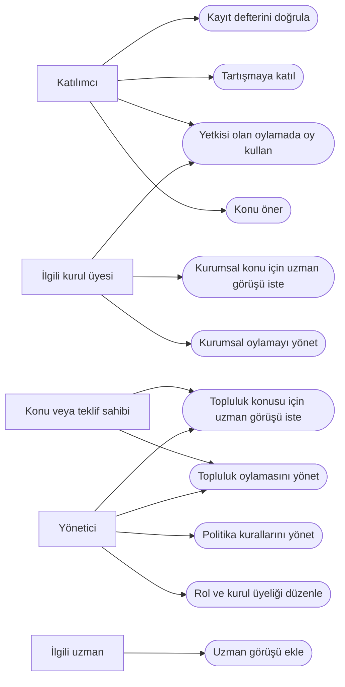
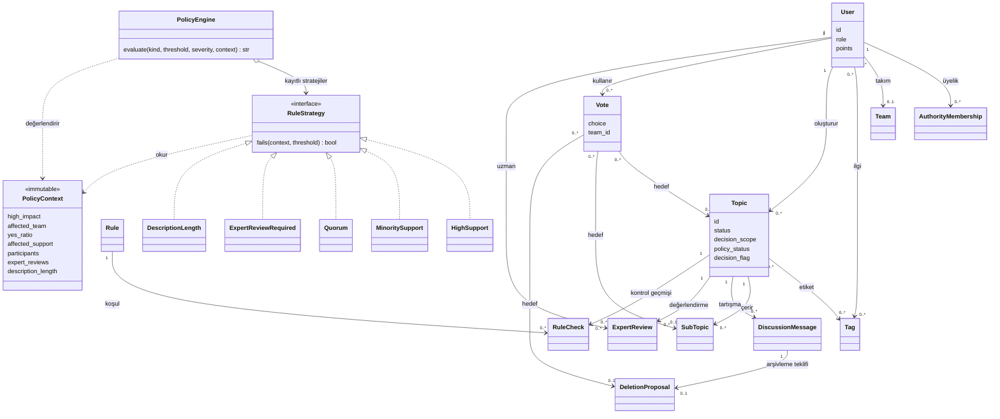
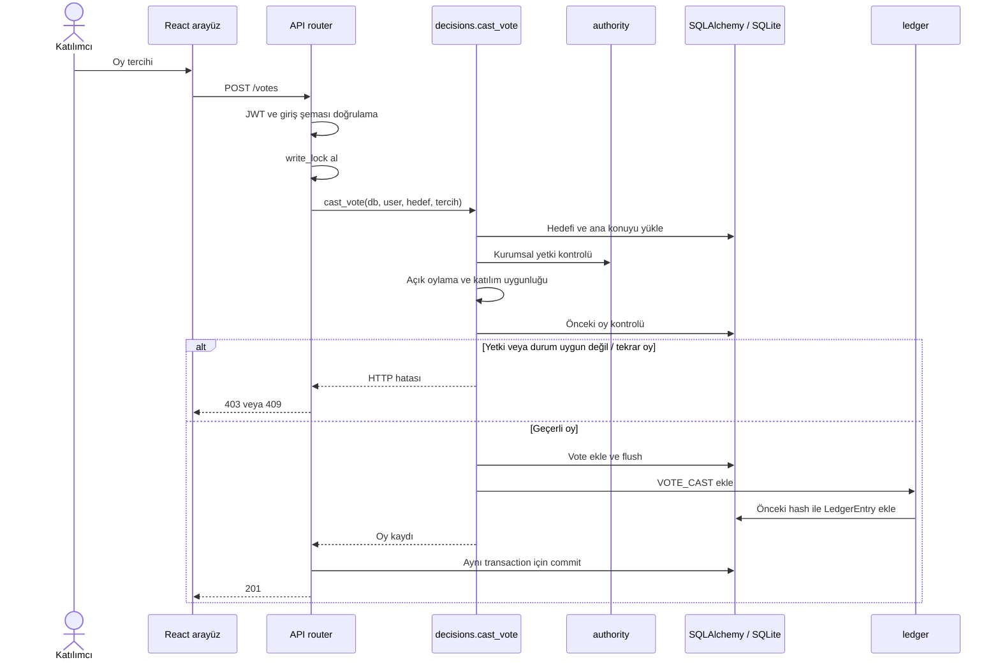
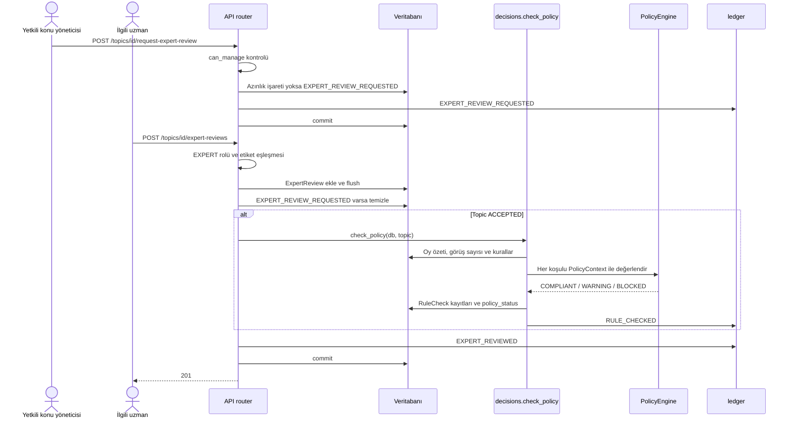
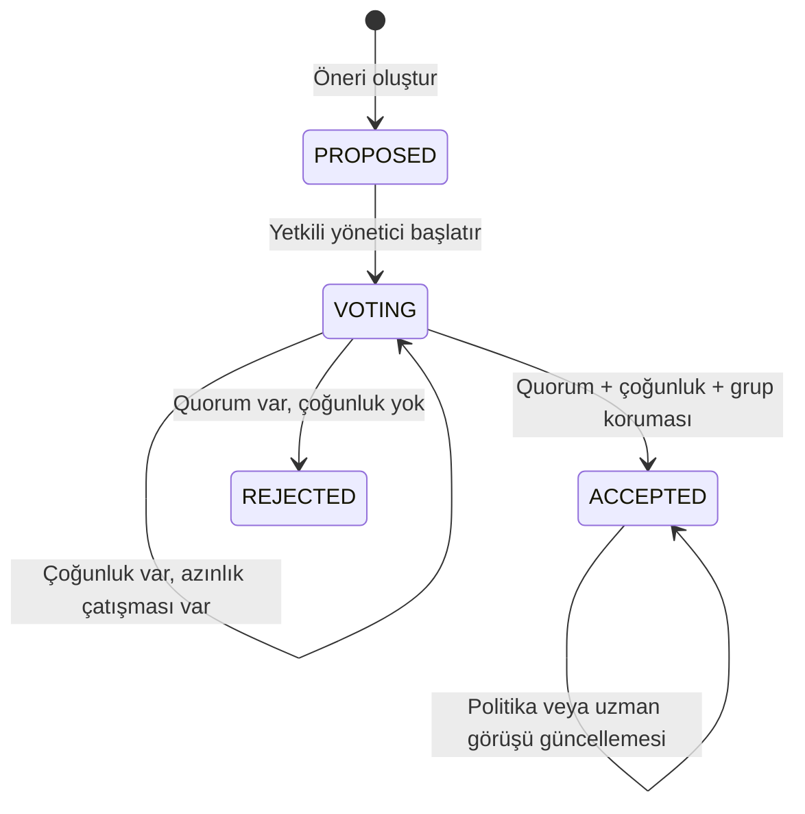
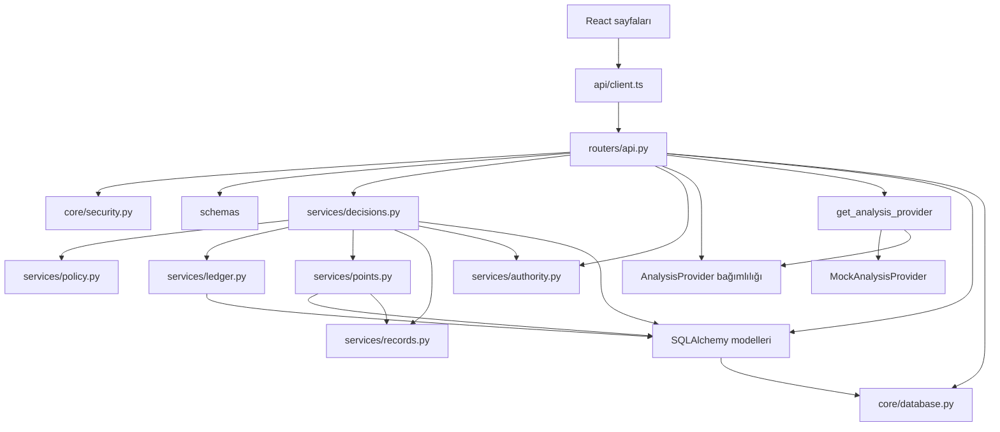

# Geliştirme tasarım notları

Bu belge uygulama revizyonunun çalışma notudur; teslim edilecek ödev raporu değildir. 8 Ekim 2026 tarihinde paylaşılan dört ders PDF'i incelendi. Aşağıdaki uygulama eşlemesi bu notlara dayanır; ayrı laboratuvar ödevlerinin tamamının bu projeye zorunlu olduğu varsayılmamıştır. Aşağıdaki modeller mevcut kodu açıklar; dersin tüm gereksinimlerini veya bütün SOLID ilkelerine tam uyumu kanıtlama iddiası taşımaz.

## Aktörler ve kullanım durumları

| Aktör | Kullanım durumu ve sınır |
|---|---|
| Katılımcı | Öneri ve tartışma oluşturur; topluluk oylamasında ilgi alanı veya takım eşleşmesi gerekir. |
| Konu/teklif sahibi | Topluluk konusunu/teklifini yönetir; kurumsal kapsamda sahiplik tek başına yeterli değildir. |
| İlgili uzman | EXPERT rolü ve konu etiketi eşleşmesiyle görüş verir; tek başına kabul/ret kararı vermez. |
| Yönetici | Kullanıcı rolleri, kurul üyelikleri ve kuralları yönetir; kurul oyu için ayrıca üyelik gerekir. |
| Yetkili kurul üyesi | Yalnızca üyeliği olan kurumsal kapsamda oylama ve değerlendirme sürecini yönetir. |

Roller bir kişide birleşebilir. Kurul üyeliği `AuthorityMembership` ile rolden ayrı tutulur. Üniversite adları ve yetki eşlemesi demo verisidir.

### Kullanım durumu görünümü

Bu Mermaid akış görünümü aktör–kullanım durumu bağlantılarını gösterir; ayrıntılı yetki koşulları yukarıdaki tabloda ve aşağıdaki kabul ölçütlerindedir.

## Gereksinim–kod–test izlenebilirliği

Test adları mevcut testleri gösterir; bu tablo kendi başına testlerin çalıştırıldığı anlamına gelmez.

| Kimlik / kullanım durumu | Kabul ölçütü | Uygulama noktası | Doğrulama |
|---|---|---|---|
| G1 / Öneri oluştur, oylamaya aç | Başlangıç PROPOSED; yetkili yönetici VOTING yapar | `routers/api.py:start_voting`, `services/authority.py` | `test_proposed_topic_lifecycle`, `test_owner_and_admin_cannot_start_without_membership` |
| G2 / Oy kullan | İlgili/yetkili kullanıcı hedef başına yalnızca bir oy verir | `services/decisions.py:cast_vote`, `models.Vote` | `test_duplicate_vote_api`, `test_duplicate_vote_database`, `test_unrelated_cannot_vote` |
| G3 / Oylamayı sonuçlandır | En az 3 katılımcı; NORMAL >%50, HIGH ≥%60; çekimser oy yalnızca katılıma eklenir | `services/decisions.py:summary,close_vote` | `test_normal_majority_and_abstention`, `test_high_sixty_percent`, `test_no_quorum_remains_open` |
| G4 / Etkilenen grubu koru | Destek <%40 veya belirleyici grup oyu yoksa çoğunluk tek başına kabul sağlamaz | `services/decisions.py:close_vote` | `test_minority_conflict`, `test_unrepresented_affected_team_blocks`, `test_team_snapshot_stays_stable` |
| G5 / Politika kontrolü | Kabul ile uygulanabilirlik ayrıdır; zorunlu ihlal BLOCKED üretir | `services/policy.py`, `services/decisions.py:check_policy` | `test_policy_blocks_accepted_high_without_expert`, `test_rule_edit_rechecks_accepted_topics` |
| G6 / Uzman değerlendirmesini tamamla | Görüş bekleme işareti temizlenir; kabul edilmiş konunun politikası yeniden hesaplanır; azınlık engeli korunur | `routers/api.py:add_review,request_review,rerun_policy` | `test_policy_review_unblocks_without_changing_vote`, `test_expert_scope_and_no_unilateral_decision`; ek API regresyon kapsamı: `test_review_workflow.py` |
| G7 / Kurumsal yetkiyi uygula | ADMIN rolü kurul üyeliğinin yerine geçmez; üyelik kaldırılınca yetki kalkar | `services/authority.py` | `test_only_admin_assigns_membership_and_board_can_decide`, `test_wrong_board_and_revocation` |
| G8 / Geçmişi koru | Arşivleme içeriği silmez; olay değişiklikleri hash zincirinde denetlenir | `services/ledger.py`, `services/decisions.py:close_vote` | `test_archive_preserves_message`, `test_ledger_detects_payload_and_metadata_tamper` |
| G9 / Katkı puanı | Günlük 10, konu başına 8; puan oy ağırlığını değiştirmez | `services/points.py` | `test_point_limits_and_idempotence`, `test_reputation_does_not_weight_vote` |

`test_review_workflow.py` ek regresyonları: `test_accepted_review_request_resolves_and_restores_applicability`, `test_expert_review_rechecks_policy_for_accepted_high_impact_topic`, `test_closing_vote_preserves_pending_expert_request`, `test_expert_review_does_not_override_minority_conflict`, `test_institutional_management_matches_board_authority`. Sonuçlar ayrıca test çalıştırma çıktısıyla doğrulanmalıdır.

## Tasarım kararları ve GoF

`policy.py` içinde **GoF Strategy** uygulanır. `PolicyEngine`, koşul türüne göre `RuleStrategy` sözleşmesini sağlayan bir algoritmayı seçer. `PolicyContext` değişmez değerlendirme verisini taşır; stratejiler HTTP veya veritabanı sorgusu yapmaz. `check_policy` oy özetini ve uzman görüşü sayısını bir kez hazırlayıp tüm kurallarda kullanır. Bilinmeyen kayıtlı koşul türü sessiz onay yerine BLOCKED üretir. Yeni algoritma için strateji ve kayıt eklenir; HTTP üzerinden yeni tür kabul edilecekse Pydantic koşul şeması da güncellenmelidir.

Ledger, puan ve kayıt bulma sorumlulukları ayrı modüllere taşınmıştır. Bu ayrım SRP yönünde iyileştirmedir. `AnalysisProvider`, `Depends(get_analysis_provider)` üzerinden sağlanır; test veya başka sağlayıcı ile değiştirme sınırı oluşturur. Bağımlılık enjeksiyonu ve SRP ayrı GoF kalıpları olarak sayılmaz. `summary` içindeki NORMAL/HIGH çoğunluk hesabı halen koşulludur; uygulanmamış bir Strategy olarak gösterilmez. Durum diyagramı da tek başına GoF State kalıbı uygulandığı anlamına gelmez.

Servisler halen SQLAlchemy modellerine ve bazı HTTP hatalarına bağlıdır; router çok sayıda uç noktayı birleştirir. Dolayısıyla bu revizyon tam bir katman ayrıştırması değildir. İhtiyaç doğmadan her modele Repository veya her işleme sınıf eklenmemiştir.

## Sınıf diyagramı

Oklar mevcut modellerdeki ilişkileri ve politika sınıflarındaki bağımlılıkları gösterir. `Vote` üç hedeften **tam olarak birine** bağlıdır; bu ayrıca DB kısıtıyla korunur. Görsel, tüm sütunları göstermeyen bir UML özetidir.

## Sekans: oy kullanma

DB benzersizlik kısıtı, uygulama kontrolüne ek güvence sağlar. Ledger yazımı başarısızsa işlem commit edilmez. Süreç içi kilit yalnızca tek backend worker varsayımında yazıları sıralar.

## Sekans: uzman görüşünü tamamlama

Görüşün olumlu olması zorunlu değildir; uzman kararı devralmaz. Görüş, azınlık çatışması işaretini silmez ve oyları değiştirmez. Uygulanabilirlik için konu ACCEPTED, politika COMPLIANT/WARNING ve bekleyen karar işareti bulunmaması gerekir.

## Konu durum modeli

`policy_status` ve `decision_flag`, ana durumdan ayrı boyutlardır: ACCEPTED olmak uygulanabilir olmakla aynı değildir. Model enum'unda ARCHIVED bulunsa da konu arşivleme uç noktası yoktur; diyagramda uygulanmış geçiş gibi gösterilmez. Mesaj arşivleme ayrı bir teklif ve oylama akışıdır.

## Modül bağımlılık grafı

Ok yönü kullanan modülden kullanılan modüle doğrudur. Bu geliştirme grafı, uygulamadaki kullanıcı/konu/takım ilişki grafından farklıdır.

## Doğrulama ve açık sınırlar

Backend regresyonları izole veritabanında çalıştırılmalı; özellikle bekleyen uzman talebinin sonuçlandırmada korunması, görüş sonrası çözülmesi, azınlık işaretinin korunması ve kurul üyelerinin yönetim işlemleri doğrulanmalıdır. Frontend için üretim derlemesi ve ilgili ekran akışları kontrol edilmelidir. Bu not herhangi bir çalıştırılmamış testi başarılı ilan etmez.

Ledger dağıtık blockchain değildir; bütün zincirin yetkili DB erişimiyle yeniden yazılmasını veya son kayıtların kesilmesini bağımsız bir referans olmadan kanıtlayamaz. Mock analiz gerçek LLM çıktısı değildir. Takım/ilgi üyelikleri demoda kullanıcı tarafından seçilir. Ders notlarıyla uygulama eşlemesi aşağıdadır; nihai rapor ve GitHub yayını ayrı aşamadır.

8 Ekim 2026 doğrulaması: izole backend testlerinde 47 test geçti; TypeScript kontrolü ve Vite üretim derlemesi tamamlandı. Mevcut Starlette/httpx deprecation uyarısı ve Vite 500 kB paket boyutu uyarısı sürüyor. Mermaid kaynakları kodla karşılaştırıldı; görsel render kontrolü henüz yapılmadı.

## Ders notlarına göre uygulama revizyonu — 8 Ekim 2026

Sayfa numaraları PDF içindeki fiziksel sayfalardır; slayt altındaki basılı numara farklı olabilir.

| Kaynak | Uygulamaya uyarlama | Sınır |
|---|---|---|
| YZM_Hafta02_Problem_Cerceveleme, s. 9–10, 16–17, 48 | `/engineering`: sekiz başlıklı, yönetici tarafından kaydedilen problem kanvası; metrik hedefleri ölçülmüş sonuçlardan ayrı | Hedefler taslak; gerçek paydaş görüşmesi yapılmadı |
| Aynı not, s. 25–30, 38, 41, 52–56 | Sabit COMMUNITY ve Türkçe anahtar kelime stratejisi; sınıf dağılımı, macro-F1, karışıklık matrisi, hatalar ve p95 hesaplama | 32 elle yazılmış sentetik örnek; bağımsız görülmemiş test kümesi değil |
| S01_YZ_Muhendisligine_Giris, s. 36–40 | Kapsam önerisi yalnız yardımcıdır; son seçim kullanıcıda, oy yetkisi ayrı deterministik kurallarda | Gerçek iş değeri, kullanıcı süresi ve maliyet iyileşmesi ölçülmedi |
| S02_Temel_Modelleri_Anlamak, s. 44–51 | Girdi doğrulama, sınırlı çıktı etiketleri, belirsizlikte insana bırakma; ekran gerçek model iddiasında bulunmaz | LLM eğitimi/API çağrısı, token ve sıcaklık deneyi eklenmedi; ayrı mini laboratuvar |
| tasarim_desenleri, s. 8–12, 36–37, 57–58 | Çalışan PolicyEngine/RuleStrategy; sorumluluk ayrımı; kapsam önerisinde iki değiştirilebilir strateji; görsel sınıf, use-case, sekans ve bağımlılık diyagramları | DI, Registry ve basit fonksiyonlar otomatik olarak ayrı GoF deseni sayılmaz. s.59 duygu analizi notebook ödevi ayrı bir örnektir |

### Yeni uygulama akışları

- Yeni konu formu başlık ve gerekçeden kapsam önerisi ister. Öneri otomatik kaydetmez, rol/üyelik değiştirmez; kullanıcı “Önerilen alanı seç” ile seçer. Metin değişince eski öneri temizlenir.
- Kanvas `project_canvas` tablosunda tutulur. Oturum açan kullanıcılar okuyabilir; yalnız ADMIN kaydeder. Her kayıt aynı transaction içinde ledger'a yazılır. Mevcut konu ve oylar korunur.
- Değerlendirme sorgusu her iki yöntemi aynı sabit JSON veri üzerinde gerçekten çalıştırır. SHA-256 ve veri sürümü görüntülenir. REVIEW bir öneriden kaçınma sütunudur; gerçek dört sınıfın macro-F1 hesabına beşinci gerçek sınıf olarak katılmaz.
- “Kapsama”, dört kapsamdan birini önerebilme oranıdır. Kapsam önerilmiş olsa da insan onayı gerekir. p95 yalnız süreç içi predict sürelerini ölçer, ağ veya uçtan uca API gecikmesini değil.
- Sentetik v1 ölçümü: sabit referans doğruluk 0,25 / macro-F1 0,10; anahtar kelime doğruluk 0,59375 / macro-F1 yaklaşık 0,6914. Hata ve çekimser örnekler saklanmıştır; bu sayılar ürün başarı iddiası değildir.

Yeni testler: `test_engineering.py` (Türkçe, belirsizlik, metrik hesabı, tekrar üretilebilirlik, oturum, kayıt değiştirmeme), `test_canvas.py` (yetki, kalıcılık, audit, şema doğrulama). Toplam 58 backend testi geçti. Gerçek kullanıcı veri toplama, bağımsız etiketleme ve kör test gelecekteki ölçüm işidir.
